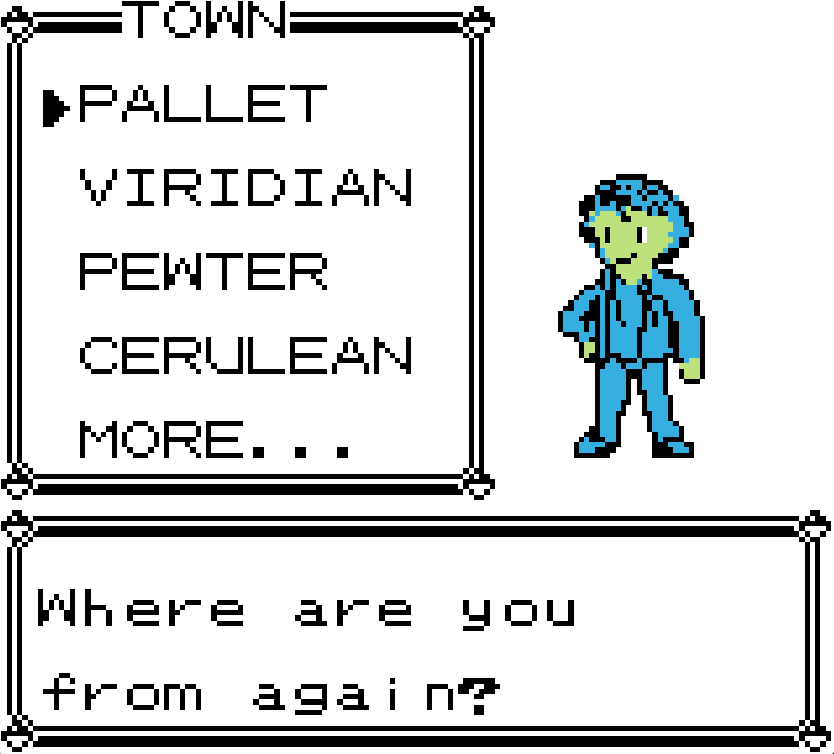

# Overview

Pokémon Open World is a mod for Pokémon Blue where you can battle gyms and obtain badges in whichever order you choose.

## Start Anywhere

Choose any town to begin your journey. All badge towns, plus Lavender Town and Pallet Town, are available to choose from.

## Unique Starters

30 starters are available across the 10 starting locations.

 
  
Expand to view the full list.

<h3>Pallet</h3>
<ul>
  <li>Bulbasaur</li>
  <li>Squirtle</li>
  <li>Charmander</li>
</ul>

<h3>Viridian</h3>
<ul>
  <li>Caterpie</li>
  <li>Nidoran♂</li>
  <li>Mankey</li>
</ul>

<h3>Pewter</h3>
<ul>
  <li>Geodude</li>
  <li>Nidoran♀</li>
  <li>Oddish</li>
</ul>

<h3>Cerulean</h3>
<ul>
  <li>Poliwag</li>
  <li>Scyther</li>
  <li>Meowth</li>
</ul>

<h3>Vermilion</h3>
<ul>
  <li>Pikachu</li>
  <li>Machop</li>
  <li>Diglett</li>
</ul>

<h3>Lavender</h3>
<ul>
  <li>Gastly</li>
  <li>Cubone</li>
  <li>Clefairy</li>
</ul>

<h3>Celadon</h3>
<ul>
  <li>Bellsprout</li>
  <li>Vulpix</li>
  <li>Porygon</li>
</ul>

<h3>Fuchsia</h3>
<ul>
  <li>Koffing</li>
  <li>Doduo</li>
  <li>Slowpoke</li>
</ul>

<h3>Saffron</h3>
<ul>
  <li>Abra</li>
  <li>Eevee</li>
  <li>Ditto</li>
</ul>

<h3>Cinnabar</h3>
<ul>
  <li>Dratini</li>
  <li>Ponyta</li>
  <li>Krabby</li>
</ul>

## Level Scaling
Trainers, gym leaders and wild pokemon encounters scale with your badge count. This means no matter your path, you will always find a challenge.

## Reduced Obstacles
Various obstacles have been moved or removed completely in order to facilitate travel without having to worry too much about having the right HMs.

- Removed the bushes in front of Vermilion and Celadon Gym
- Removed the bush at the west Diglett Cave entrance
- Moved both Snorlaxes out of the way to not block the path
- Removed the bicycle requirement at Cycling Road
- Removed the thirsty Saffron Guard check
- Removed the east Pewter City badge check
- Added Seels on Cinnabar that can take you to Pallet Town or Fuchsia City
- Added Seel in Pallet Town to take you to Cinnabar.
- Added a hole in the rock wall between the Seafoam Islands

## Other changes
- Added a Link Cable item to evolve Pokemon that normally require trades. The Link Cable can be purchased in the Celadon Dept Store.

## Known Issues
- Fished Pokémon do not scale with badge count
- The Route 22 second rival does not disappear after fighting him and has the wrong dialog.